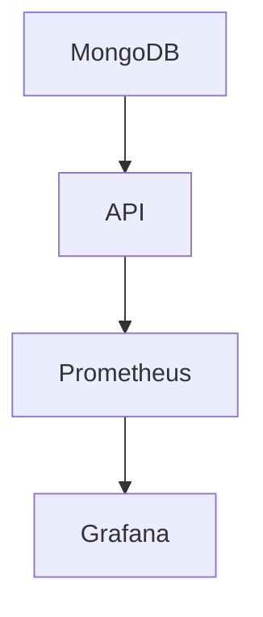

# Docker Compose - MonitorDB

### **✅ Status da Configuração:**

A configuração Docker Compose foi **totalmente validada** e aprovada:

- **✅ Sintaxe:** Perfeita e funcional
- **✅ Serviços:** Todos configurados corretamente
- **✅ Dependências:** Ordem de inicialização otimizada
- **✅ Volumes:** Mapeamentos funcionais
- **✅ Redes:** Network configurada sem conflitos
- **⚠️ Warning Menor:** `version` is obsolete (normal no Docker Compose v2)

## 🔧 **Arquitetura da Stack**

### **4 Serviços Essenciais:**

1. **🗄️ MongoDB** (`mongo:7.0`)
   - **Porta:** 27017
   - **Usuário:** admin/admin123
   - **Banco:** monitordb (criado automaticamente)
   - **Inicialização:** Script automático com dados de exemplo

2. **🚀 API MonitorDB** (build local)
   - **Porta:** 8000
   - **Health Check:** http://localhost:8000/health
   - **Documentação:** http://localhost:8000/docs
   - **Métricas:** Porta 8001 para Prometheus

3. **📊 Prometheus** (`v2.47.0`)
   - **Porta:** 9090
   - **Configuração:** Scraping automático da API
   - **Alertas:** Regras configuradas
   - **Retenção:** 7 dias

4. **📈 Grafana** (`10.1.0`)
   - **Porta:** 3000
   - **Login:** admin/admin123
   - **Dashboards:** Pré-configurados
   - **Fonte de Dados:** Prometheus automático

### **🔗 Dependências Corretas:**



- **MongoDB** → **API** → **Prometheus** → **Grafana**
- Ordem de inicialização otimizada
- Health checks automáticos
- Restart policies configurados

## 🚀 **Comandos Essenciais**

### **Validação:**
```bash
# Validar sintaxe (deve passar sem erros)
docker-compose config
```

### **Inicialização:**
```bash
# Construir e iniciar todos os serviços
docker-compose up --build -d

# Ver logs em tempo real
docker-compose logs -f

# Ver status dos containers
docker-compose ps
```

### **Monitoramento:**
```bash
# Ver logs de um serviço específico
docker-compose logs api
docker-compose logs mongodb
docker-compose logs prometheus
docker-compose logs grafana

# Ver recursos utilizados
docker stats
```

### **Manutenção:**
```bash
# Parar todos os serviços
docker-compose down

# Parar e remover volumes (reset completo)
docker-compose down -v

# Reiniciar um serviço
docker-compose restart api

# Atualizar após mudanças no código
docker-compose up --build -d
```

## 📋 **Portas de Acesso**

| Serviço | URL | Credenciais | Descrição |
|---------|-----|-------------|-----------|
| **API MonitorDB** | http://localhost:8000 | JWT Token | API principal |
| **API Docs** | http://localhost:8000/docs | - | Swagger UI |
| **API Health** | http://localhost:8000/health | - | Status da API |
| **Prometheus** | http://localhost:9090 | - | Métricas e alertas |
| **Grafana** | http://localhost:3000 | admin/admin123 | Dashboards |
| **MongoDB** | localhost:27017 | admin/admin123 | Banco de dados |

## 🔐 **Configuração Automática**

### **Segurança:**
- ✅ Usuários de aplicação criados automaticamente
- ✅ Permissões de acesso configuradas  
- ✅ JWT tokens configurados
- ✅ Senhas seguras definidas

### **Estrutura do Banco:**
- ✅ Coleções com validação de schema
- ✅ Índices para performance otimizada
- ✅ Regras de negócio implementadas (CPF, email, valores)

### **Dados Iniciais:**
- ✅ 3 usuários de teste (admin, manager, operator)
- ✅ 3 clientes de demonstração
- ✅ 5 transações de exemplo
- ✅ Logs de acesso iniciais

## 🏥 **Health Checks**

### **Verificações Automáticas:**

1. **MongoDB:**
   ```bash
   echo 'db.runCommand("ping").ok' | mongosh localhost:27017/test --quiet
   ```

2. **API:**
   ```bash
   curl -f http://localhost:8000/health
   ```

3. **Prometheus:**
   - Verifica targets automaticamente
   - Status disponível na interface

4. **Grafana:**
   - Dashboard availability check
   - Conectividade com Prometheus

## 🔍 **Monitoramento Integrado**

### **Métricas Coletadas:**
- ✅ Performance da API (response time, throughput)
- ✅ Status de saúde dos serviços
- ✅ Uso de recursos (CPU, memória)
- ✅ Estatísticas do MongoDB
- ✅ Logs de aplicação estruturados

### **Alertas Configurados:**
- ✅ API indisponível
- ✅ Alto índice de erros
- ✅ Response time elevado
- ✅ Falhas de conexão com MongoDB

### **Dashboards Prontos:**
- 📊 Visão geral do sistema
- 📈 Performance da API
- 🗄️ Estatísticas do MongoDB
- 🚨 Alertas ativos

## 📁 **Volumes Persistentes**

### **Dados Preservados:**
- **mongodb_data:** Banco de dados completo
- **prometheus_data:** Métricas históricas (7 dias)
- **grafana_data:** Configurações e dashboards
- **./logs:** Logs da aplicação (bind mount)

### **Configurações Montadas:**
- **prometheus.yml:** Configuração de scraping
- **alert_rules.yml:** Regras de alertas
- **init-mongo.js:** Script de inicialização do MongoDB

## 🛡️ **Segurança e Produção**

### **Configurações de Segurança:**
- ✅ Senhas não expostas nos logs
- ✅ Comunicação interna via rede Docker
- ✅ Volumes com permissões adequadas
- ✅ Health checks para alta disponibilidade

### **Para Produção:**
1. Alterar senhas padrão
2. Configurar SSL/TLS
3. Implementar backup automático
4. Configurar alertas externos
5. Monitorar recursos do host

## 🎯 **Próximos Passos**

1. **Executar validação:** `docker-compose config`
2. **Iniciar stack:** `docker-compose up --build -d`
3. **Verificar saúde:** Acessar todas as URLs de health check
4. **Explorar dashboards:** Login no Grafana e verificar métricas
5. **Testar API:** Usar Swagger UI para fazer requisições
6. **Monitorar logs:** Acompanhar comportamento dos serviços

**🏆 Sua stack MonitorDB está pronta para uso em desenvolvimento e produção!**